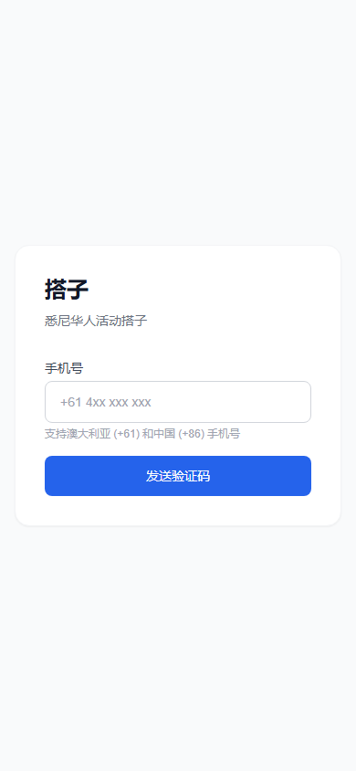
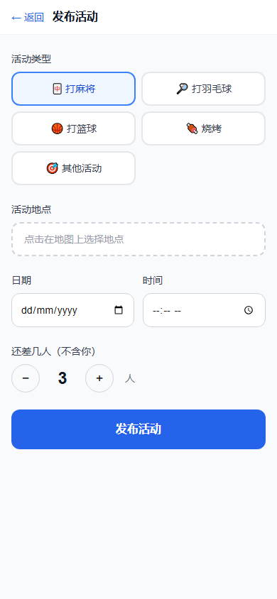

# 搭子 Dazi

**帮你 5 分钟找到人一起打麻将、打球、烧烤。** 面向悉尼海外华人的即时活动匹配 Web App。

<p align="center">
  
  &nbsp;&nbsp;
  
</p>

---

## 功能

- **地图发现** — 在 Mapbox 地图上查看附近所有开放活动
- **手机号登录** — 支持澳大利亚 (+61) 和中国 (+86) 手机号 OTP 登录
- **发布活动** — 地图点选位置、选时间、选人数，一键发布
- **加入活动** — 并发安全的加入逻辑，满员自动关闭
- **约局频道** — 活动成员专属实时聊天（Supabase Realtime）
- **自动过期** — Vercel Cron 每 5 分钟将到期活动标记为 expired

## 用户流程

```
打开 App → 地图看到附近活动 → 点击加入 → 进入约局频道和大家打招呼
         ↓
     没有活动？ → 发布活动 → 等人来加入
```

## 技术栈

| 层 | 技术 |
|----|------|
| Frontend | Next.js 14 + TypeScript + Tailwind CSS |
| Backend | Supabase (PostgreSQL + Auth + Realtime) |
| 地图 | Mapbox GL JS (dynamic import) |
| 部署 | Vercel + Vercel Cron |

## 本地开发

**前置条件**：Node.js 18+、Docker（用于本地 Supabase）

```bash
# 1. 克隆仓库
git clone https://github.com/Heatescape/Dazi.git
cd Dazi

# 2. 安装依赖
npm install

# 3. 配置环境变量
cp .env.example .env.local
# 编辑 .env.local 填入你的 keys

# 4. 启动本地 Supabase
npx supabase start

# 5. 启动开发服务器
npm run dev
```

打开 http://localhost:3000

### 本地测试账号（本地 Supabase）

在 `supabase/config.toml` 中已配置测试 OTP：
- 手机号：`+61412345678`，验证码：`000000`

## 部署

### Supabase Cloud

1. 创建项目：https://supabase.com → New Project → Region: Singapore
2. 在 SQL Editor 执行 `supabase/migrations/` 中的建表 SQL
3. Authentication → Providers → Phone：配置 SMS 提供商

### Vercel

```bash
npx vercel --prod
```

在 Vercel Dashboard 配置以下环境变量（参考 `.env.example`）：

- `NEXT_PUBLIC_SUPABASE_URL`
- `NEXT_PUBLIC_SUPABASE_ANON_KEY`
- `SUPABASE_SERVICE_ROLE_KEY`
- `NEXT_PUBLIC_MAPBOX_TOKEN`
- `CRON_SECRET`

Cron Job 已在 `vercel.json` 中配置，部署后自动生效。

## 数据库结构

```
profiles          — 用户资料 (display_name, avatar_url)
activities        — 活动 (type, location, time, spots)
activity_members  — 活动成员关系
channel_messages  — 约局频道消息（7天后软删除）
```

## License

MIT
